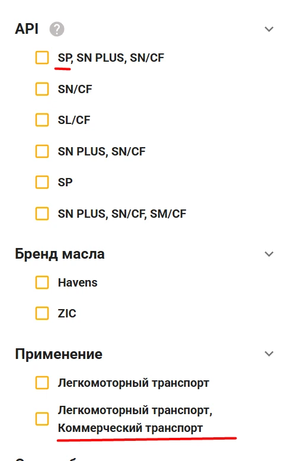

**Бренды(Страница в Покупателях)**:
- Переделать ссылку у **brands** на **oil-brands**

**Каталоги**:
- Как-то неправильно у нас привязаны [каталоги](https://test.maslo-spb.ru/catalogs) в иерархии: Например, сопутствующие товары лежат в Аксессуарах, а Фильтры находятся в Запчастях.

**История выгрузок из Мой Склад в Админке**:
- Неправильное время (не по Мск сохраняется в историю)

**Витрины**:
- Булево поле "Проверено лабораторно" выгружается везде, хотя должно только в Моторных маслах (фасованных и разливных). Надо понять, что с этим делать.

- Нам бы пагинацию на витринах сделать, чтоб на каждой странице не более 50-ти товаров загружалось (это запишу в тег для фронта и бэка).

- Передавать ссылку для тултипа на тот термин, из которого берётся контент, чтобы по клике на вопросик можно было перейти на этот термин в вики - Посмотреть, было ли это.

- В фильтрах почему-то значения характеристик, которые выгружаются через запятую из Моего Склада выделены в отдельные значения:

Такого не должно быть, нужно, чтобы значения, которые выгружаются из Мой Склад через запятую распределялись по значениям в единственном экземпляре.

**Профиль фасованного товара**:
- Надо выгружать объём по порядку