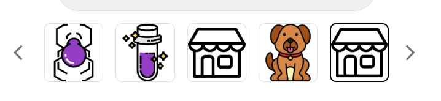
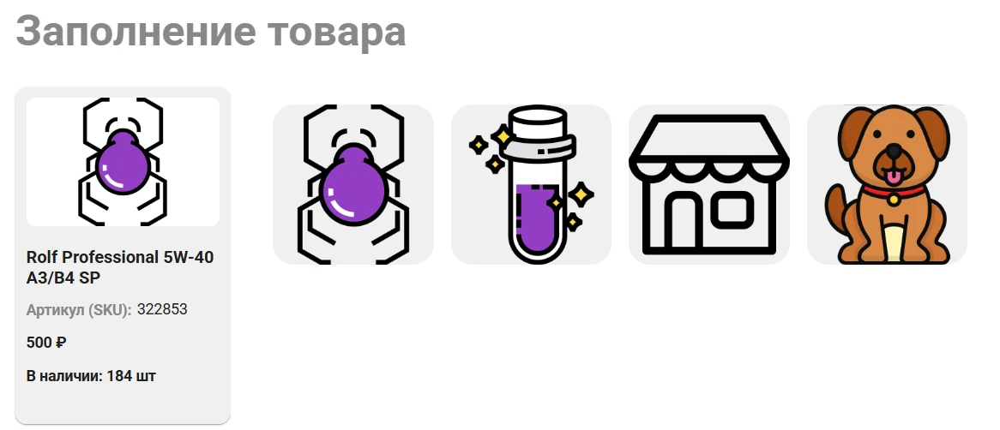

# Десктоп:
**Хэдер**:
- Нужно переименовать 3 кнопки, как на макете и привязать к ним соответствующие витрины
- У этих трёх кнопок есть одинаковый [ховер](https://www.figma.com/design/TQrXQTtTwlnhrJIVcBIVbY/%D0%9C%D0%B0%D1%81%D0%BB%D0%BE-%D0%A1%D0%9F%D0%91?node-id=2312-51298&t=QiCowKPeF6392Nkq-4)
- Переименовать "Стоянка" на "Автопарк"
- Placeholder в поиске поменять на "Введите артикул/наименование запчасти или масла..."

**Футер**:
- Поменять список моторных масел на тот, что на макете

**Витрины (касается всех)**:
- Получать ссылку для тултипа на тот термин, из которого берётся контент, чтобы по клике на вопросик можно было перейти на этот термин в вики (тултипы вообще только в моторных маслах, но на всякий случай поместил проблему для всех типов витрин, ибо это вроде как реализовано по совпадению наименований с вики);

- Сделать тень при ховере и добавить stroke 1px цвета `#E4E4E4`. Пример на [макете](https://www.figma.com/design/TQrXQTtTwlnhrJIVcBIVbY/%D0%9C%D0%B0%D1%81%D0%BB%D0%BE-%D0%A1%D0%9F%D0%91?node-id=2422-44516&t=QiCowKPeF6392Nkq-4);

**Витрины моторных масел**:
- Попап при клике на вопросик около Качества:
	- Странно как-то выделены ссылки (На мобилке кста норм, там зелёным выделены)

**Покупателям (меню)**:
- Убрать "Наши исследования"

**Настройка рекомендаций витрин**:
- В ТЗ прям супер детально не было прописано про то, как осуществлять поиск по товарам в поп-апе, однако было написано следующее "Он выбирает витрину и может выбирать в попапе **рекомендуемый товар** для каждой из 3-х позиций, а после сохранять по кнопке". Про то, что товар должен быть из этой же витрины ни слова не было. В данной реализации я не могу выбрать для выбранной витрины рекомендуемый товар, что означает, что реализация противоречит ТЗ.

Как нужно реализовать настройку рекомендаций витрин:
1) Пользователь выбирает витрину. После выбора витрины:
	- Подгружаются уже выбранные рекомендации этой витрины и пустоты, если они есть.
2) При нажатии на существующую или пустую рекомендацию вылезает поп-ап, функционал которого позволяет:
	- Выбрать витрину, из которой будем брать рекомендацию:
		- Рекомендации можно брать из разных витрин, т.е. для выбранной витрины (назовём её А), для которой хотим назначить рекомендации мы можем, например, зайти в витрину В, выбрать 2 рекомендации, потом зайти в витрину С и выбрать там 3-ю рекомендацию. Итог мы выбрали для витрины А две рекомендации из витрины В и одну рекомендацию витрины С.
3) Нажимает на кнопку Сохранить, чтобы зафиксировать изменения.

**Под вопросом:**
**Заполнение витрин (Редактирование картинок в любом типе витрин):**
- Какие-то баги происходят при удалении и добавлении картинок. Я понимаю, почему ты решила сделать смещение картинок влево при удалении (чтобы не было пустот в картинках в Профиле товара), но если попробовать подобавлять и поудалять картинки, то они начнут иногда задваиваться, а иногда и вовсе превышать ограничение в ui на 4 картинки. Скриншоты из [Профиля товара](https://test.maslo-spb.ru/product/322853-45523388) и из Админки соответственно:

- Разливной товар:
	- Исправить остаток со штук на литры
# Мобилка
**Хэдер**:
- Placeholder в поиске поменять на "Введите артикул/наименование запчасти или масла..."