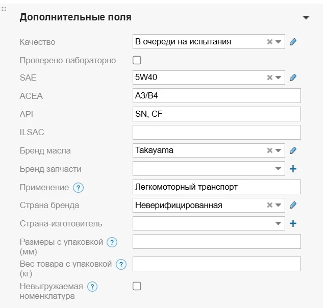

1) Регистрация покупателей (самостоятельно и через Клиентолога)

2) Автопарк

3) Запрос комплектующий для ТО

4) Заказ неавторизованного и авторизованного пользователей, Адреса доставки.

5) Оформление заказа

6) История заказов, заявок и запросов.

Прочее:
# Мобилка
**Боковое меню**:
- Поправить контент так, как на [макете](https://www.figma.com/design/TQrXQTtTwlnhrJIVcBIVbY/%D0%9C%D0%B0%D1%81%D0%BB%D0%BE-%D0%A1%D0%9F%D0%91?node-id=1214-17435&t=QiCowKPeF6392Nkq-4) 

# Десктоп
**Витрина:**
- Надо понять, как сортировать фильтры в таком же порядке, как в Моём Складе:

