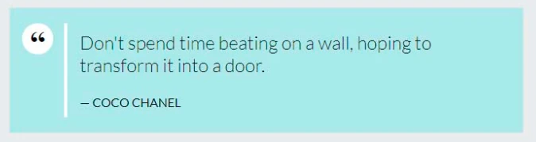

Вкладки:
- Мониторинг ссылок
	- Кнопка "Сгенерировать метрику"
	
	- Список блоков горизонтальных блоков: 
		- Редактируемое наименование
		- Сгенерированная read-only ссылками
		- Счётчик переходов
		
- Блог
	- Просмотр существующих статей и возможность их редактирования/удаления
	- Кнопка "Добавить Статью" и переход в редактор новой статьи:
	- Поле "Название статьи"
	- Картинка-превью (Будет отображаться только в превью статьи)
	
	- [WYSIWYG](https://codesandbox.io/p/devbox/mui-tiptap-demo-3zl2l6)-можно что-то такое, однако нужно ещё в дополнение к этому добавить возможности форматирования:
		- ==Highlighter должен быть скруглённой формы==
		- Аннотация - просто "Всплывашка" с текстом (который тоже можно выделять и форматировать, но без добавления "Всплывашек" и ссылок на словарь)
		- Ссылка на словарь терминов:
			- Выбор из существующих терминов
			- Отображается так, как описано [тут](../Страницы%20покупателя/Типовые%20страницы/Страница%20содержимого%20любой%20статьи.md#^aeae1c)
		- Цитата будет отображаться так, как ниже на скрине с [сайта](https://html5book.ru/krasivoe-oformlenie-citat-na-sayte/), однако бы немного переделать под наш стиль

 ^28b1f0

- Словарь терминов
	- Кнопка "Создать термин":
		- Поля "Заголовок" и "Определение термина"

- Отзывы
	 - Кнопка "Создать отзыв" и поля для заполнения:
		 - Имя
		 - Количество звёзд
		 - Дата
		 - Тело комментария
		 - Площадку со ссылкой на неё (просто возможность добавить картинку и ссылку. При нажатии на картинку можно перейти по ссылке)
	- Возможность удаления отзыва по соответствующей кнопке

- Сертификаты
	- Окно добавления файла pdf или png и отображение в виде иконок pdf или png в зависимости от формата. При нажатии - pdf открывается в новой вкладке, а png во всплывающем окне
	- Добавлять текстом разделы:
		- В каждый раздел можно добавлять pdf и png
		- Разделы будут выделенными жирным шрифтом и идти просто сверху вниз
		- Чисто для визуальной группировки без какого-либо другого функционала

